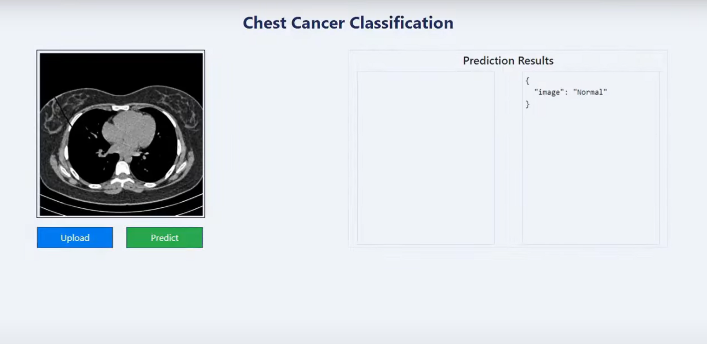

# End-to-End Chest Cancer Classification using MLflow & DVC

This project implements an end-to-end chest cancer classification pipeline using **MLflow** and **DVC**.

## **UI Demo**
The following is a screenshot of the web interface for the chest cancer classification system:

Users can upload a **chest scan image**, and the model predicts whether the image is **normal** or indicates cancer.

## **Features**
- **Machine Learning Model**: Trained using CNN-based deep learning architecture.
- **Experiment Tracking**: Uses MLflow for logging and tracking experiments.
- **Data Versioning**: Managed with DVC.
- **Deployment**: FastAPI-based model deployment.
